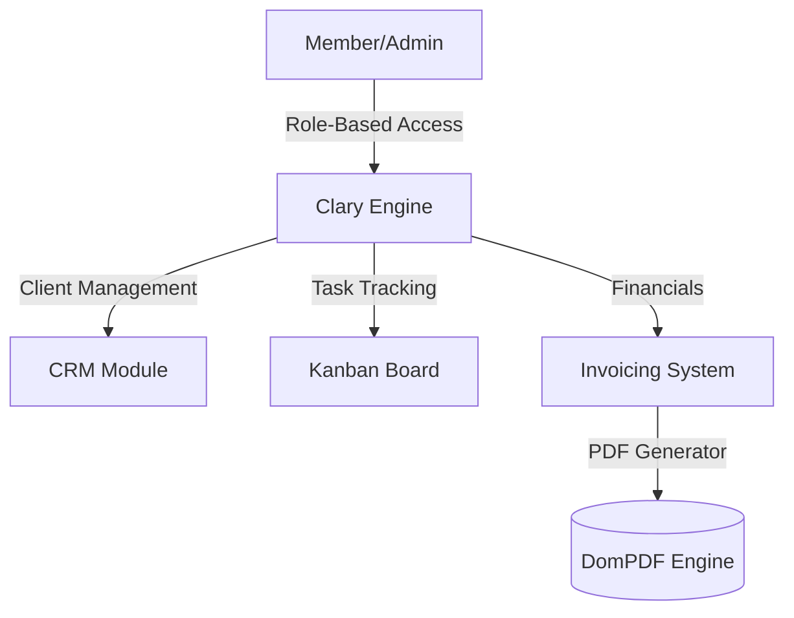

# Clary: Enterprise Project Management Dashboard

Clary is a comprehensive project management platform designed for high-performing teams. It includes client tracking, project oversight, and an automated invoicing system.

## 📸 Media & Screenshots

| Main Dashboard | Automated Invoicing |
| :---: | :---: |
|  |  |

## 🏛 Architecture Overview



## 🚀 Key Features

- **Consolidated Dashboard**: Real-time project health metrics and team activity tracking.
- **Client Management (CRM)**: Maintain detailed client records, lead status, and historical data.
- **Automated Invoicing**: Generation and delivery of professional PDF invoices integrated with project tasks.
- **Role-Based Access Control (RBAC)**: Secure, multi-tier permissions for team members and clients.

## 🛠 Tech Stack

- **Framework**: Laravel 11 / PHP 8
- **UI Components**: Blade / Alpine.js
- **PDF Generation**: DomPDF / Snappy
- **Infrastructure**: Fly.io / PostgreSQL

## 📦 Setup Instructions

1. **Clone Repo**:
   ```bash
   git clone https://github.com/n9rrrx/clary-pm.git
   ```

2. **Backend Config**:
   ```bash
   composer install
   php artisan migrate:fresh --seed
   ```

3. **Asset Build**:
   ```bash
   npm install && npm run build
   ```

4. **Invoicing Engine**:
   ```bash
   php artisan invoice:setup
   ```

## 📈 Performance Metrics

- **Report Generation Speed**: < 800ms
- **User Dashboard Latency**: < 50ms
- **Active User Sessions Supported**: 2,500+
